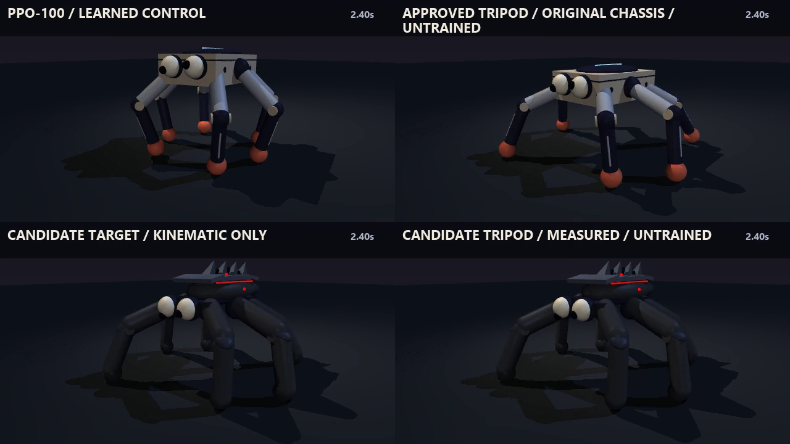

# Locked design direction — 2026-09-15

Six legs, metallic black armor, red lights and accents, white googly eyes.
The user approved the candidate silhouette shown in the bottom two review
panes, then requested gravity-driven pupils and breathing/pulsing red lights.

This archive locks a **design direction**, not a new robotics capability.
`candidate.xml` is a standalone model snapshot. The canonical original model and
the accepted PPO-100 are preserved. Physical edits are listed in `manifest.json`:
vertical coxa axes, wider hip/knee ranges, matching target ranges, and a reset
coordinate adjustment that preserves the original initial physical pose.

The pupil model follows the direction of gravity and measured translational
acceleration in the rotating eye housing. It uses damped motion with a bounded
surface position. It is decorative and does not affect robot dynamics. It omits
rotational inertial forces within the eyes. Red light animation uses a four-second
breath and a one-second double pulse, driven by recorded time.

The measured candidate tripod travelled 1.40261 m in five seconds without a fall
in that one rollout. Its 0.28052 m/s is slower than the approved original-chassis
tripod (0.30616 m/s) and accepted learned PPO-100 (0.37883 m/s).
No new learned policy has earned a recommendation.

Final appearance was rendered from the measured states after exact equality
checks on the old and refreshed model's physical arrays. Only appearance changed.
Source copies and hashes are included for reconstruction. Full local movies and
measured records are identified by `manifest.json`.
