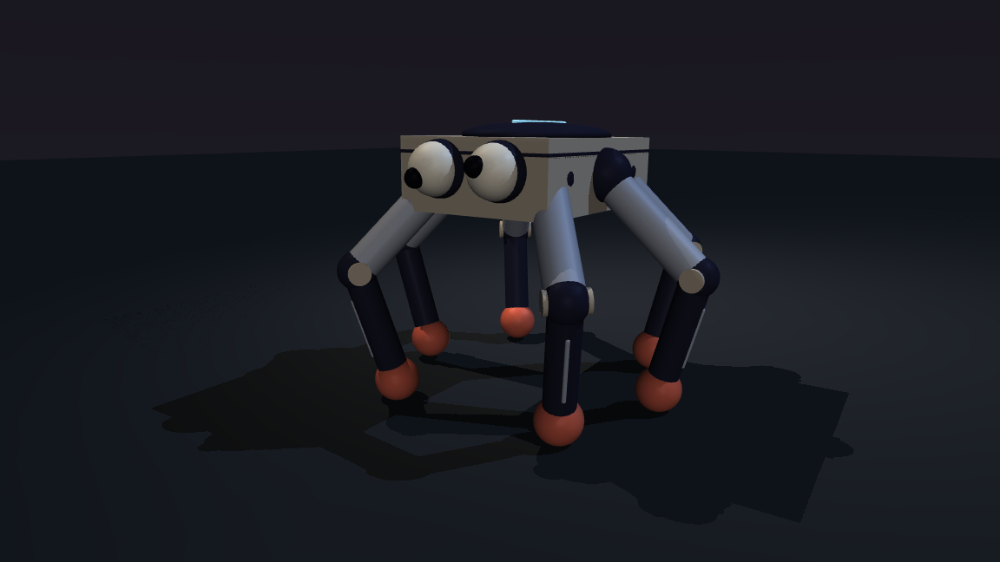

# PPO in the C-1N platform

Notebook 04 is frozen at the accepted
[PPO-100 crude baseline](../artifacts/ppo-crude-baseline-20260915/README.md).
It owns the experiment record and the user's learner. Runtime policy execution
lives in `spider/policy.py` and `spider/policy_run.py`. Neither imports `lab` or
reads notebook code. These modules perform inference; they do not train PPO.
The separate `spider/policy_training.py` module now supports continuation
training. Each new training round requires the user's approval.

## Reviewed result: action-rate round, 2026-09-15

The user rejected all three continuation treatments: the motion still looked
like vibration, not a deliberate stride. No candidate was promoted. The accepted
crude baseline remains the comparison; this round does not earn STRIDE.

Run evidence is in `telemetry/tuning/20260915-rate-round-01/`: `plan.json`,
`summary.csv`, per-branch training configurations/checkpoints, exact evaluation
recordings, and `comparison.mp4`. These are local ignored artifacts. The film
shows five seconds at normal speed, with four synchronized panels at 50 fps.

Each branch started independently from PPO-100, used the lower posture treatment,
and trained for ten updates. Action-rate weights were 0, 3.731162618445504, and
9.32790654611376. The pedagogical action range and base reward remained fixed.
Evaluation used twelve sampled seeds (201 through 212) and one mean-action
episode (201) per policy, including the frozen lower control. All 52 five-second
episodes completed without a fall. Mean-action resets are deterministic; repeating
them with different sampling seeds would not provide independent scenarios.

| Mean-action treatment | Forward speed (m/s) | Absolute lateral travel (m) | Target-change RMS (rad) |
| --- | ---: | ---: | ---: |
| Frozen lower | 0.3927 | 0.1056 | 0.03834 |
| Continued, no penalty | 0.3959 | 0.2344 | 0.03889 |
| Small penalty | 0.4039 | 0.3355 | 0.04044 |
| Medium penalty | 0.3334 | 0.7601 | 0.03857 |

The small penalty increased speed but did not reduce target-change RMS or produce
an accepted stride. Endpoint stance-foot velocity is only a diagnostic: it can
miss movement within a control interval and excludes contact transitions.

The next proposed treatment starts with fresh weights and optimizer state,
larger per-joint target ranges, previous-action and phase observations, and
explicit speed, support, and clearance objectives. The proposed first budget is
three initialization seeds through 50 updates, followed by review. The user
approved this next round on 2026-09-15. Approval is not evidence of a learned gait.

## Fresh phase-guided round

The approved treatment starts from new weights and optimizer state. It uses a
phase clock to specify support and swing timing; PPO learns the joint targets.
No authored joint trajectory or playback speed change supplies forward travel.

| Parameter | First round |
| --- | --- |
| Initialization seeds | 11, 22, 33 |
| Budget | 50 updates per seed; stop for review |
| Control interval | 40 ms; 20 unchanged 2 ms physics steps |
| Joint target ranges, rad | Coxa [-0.65, 0.65], hip [-0.70, 0.55], knee [0.15, 1.35] |
| Observation | 47 physical-state values plus 18 previous targets, speed command, sine/cosine phase |
| Gait timing | 1.25 Hz; alternating tripods; 60% stance |
| Torso height target | 0.43 m |
| Initial speed command | 0.25 m/s |
| Swing foot-centre peak | 0.11 m, about 0.065 m ground clearance |

The initial speed command deliberately starts below the final speed acceptance
threshold. This first round asks whether visible strides begin to form. It cannot
complete the project goal unless later evidence meets the full speed, stability,
and user-reviewed motion requirements. Larger target bounds permit exploration;
they do not establish collision-free or stable motion throughout those bounds.

The new modules are `spider/stride_policy.py` and `spider/stride_training.py`.
`spider/stride_round.py` owns the bounded run. The old continuation trainer remains
available to reproduce the rejected experiment. All training belongs to the
Python platform; the notebook and accepted checkpoint stay frozen.

### First fresh round result

`telemetry/tuning/20260915-fresh-stride-round-01/` contains the completed round:
150 total updates, 52 evaluation episodes, configurations, source copies and
hashes, checkpoints 0 through 50 for each seed, raw reward traces, and the
five-second `comparison.mp4`. Execution took 363.5 seconds. The film uses exact
recorded timestamps at 25 fps to align the two control cadences.

| Policy | Mean-action speed (m/s) | Mean-action travel in 5 s (m) | Sampled falls / 12 |
| --- | ---: | ---: | ---: |
| Accepted PPO-100 | 0.37883 | 1.89414 | 0 |
| Fresh seed 11, update 50 | 0.00313 | 0.01564 | 10 |
| Fresh seed 22, update 50 | -0.00020 | -0.00101 | 9 |
| Fresh seed 33, update 50 | -0.00611 | -0.03056 | 8 |

All four mean-action episodes stayed above the fall threshold. The fresh mean
policies barely travel; 27 of their 36 sampled episodes fell. A calmer mean
policy is not evidence of a reliable learned stride. Larger sampled joint motion
and foot heights include falls and must not be presented as useful gait amplitude.

User review: "this looks better but doesn't reward forward motion enough".
Preserve the improved visual direction, but no fresh policy is accepted as the
walk baseline. The full speed and stability goal remains unmet. A proposed next
comparison raises the speed command to 0.4 m/s and the forward tracking weight;
it requires approval before execution. No further updates ran in this round.

## Empirical acceptance gate

Notebook 04 checks PPO mechanics: saved log probabilities, GAE, loss gradients,
finite updates, weight changes, and checkpoint consistency. Its
`ppo-evaluation` and `ppo-checkpoint-run` cells report policy measurements but
do not assert a policy-quality threshold. The following **new** gate derives
from the accepted PPO-100 measurements and the user's zero-fall requirement.
It is implemented in `spider/policy_acceptance.py`; it does not execute cells.
The source checks live in the frozen cells `ppo-collect-function`,
`ppo-gae-diagnostic`, `ppo-loss-check`, and `ppo-schedule`. These test algorithm
correctness; passing them cannot establish locomotion quality.

```powershell
.venv/Scripts/python -m spider check-policy --round telemetry/tuning/20260915-fresh-stride-round-01
```

The command inspects existing recordings and writes `acceptance.json`. A failed
gate returns exit code 1. Future `train-stride` and `tune-rate` rounds run the same gate and
return failure when the recorded candidates fail, even when optimization itself
completed successfully.

Each policy must provide one mean-action recording and all twelve distinct
sampled seeds 201 through 212. The gate requires:

- Zero falls and a complete five seconds in every episode.
- Finite recorded states and measurements, valid target bounds, and consistent
  model/checkpoint provenance.
- Mean-action speed at least the accepted PPO-100 mean-action speed,
  approximately 0.378827 m/s.
- Sampled mean speed at least the accepted PPO-100 sampled mean speed,
  approximately 0.274276 m/s.

Missing, duplicate, or invalid evidence fails the gate. Speed references come
from the preserved baseline CSV. Rewards are not compared across different
objective definitions. Passing numerical checks still requires the user's gait
review; the gate never promotes a policy or earns STRIDE automatically.

The twelve sampled seeds vary action noise from the same reset. They do not test
terrain, pushes, or distinct initial postures. Zero observed falls in twelve
episodes is a finite test result, not a guarantee of zero fall probability.
The frozen notebook and its historical findings remain unchanged.

On the saved first fresh round, the accepted baseline passes the numerical gate.
All three fresh candidates fail for sampled falls, incomplete episodes, and
forward speed below the reference. The round is marked `failed-acceptance`.
The user's later review explicitly rejects the 75% sampled fall rate despite
the calmer mean-action appearance.

## Forward incentive and exploration comparison

The user approved this next round after reviewing the recordings. Three fresh
policies share initialization seed 11 and the same sampling-seed schedule. Each
trains for exactly 50 updates. The accepted PPO-100 is the fourth replay pane.

| Treatment | Initial noise multiplier | Entropy coefficient | Speed command (m/s) | Forward reward weight |
| --- | ---: | ---: | ---: | ---: |
| Lower exploration | 0.4 | 0 | 0.25 | 1.5 |
| Stronger forward | 1.0 | 0.003 | 0.4 | 4.0 |
| Combined | 0.4 | 0 | 0.4 | 4.0 |

Noise scaling changes the initial latent distribution's standard deviation.
The mean network weights, broad action bounds, phase clock, and physics stay
fixed. Exploration remains learnable. Each checkpoint stores its own speed
command and objective; replay uses that saved command. The previous round's
checkpoints remain loadable with their original settings.

```powershell
.venv/Scripts/python -m spider train-stride --comparison forward-exploration --output telemetry/tuning/20260915-forward-exploration-round-01
```

This command runs training and evaluation. It saves the complete plan before
training, then runs the empirical acceptance gate. It does not extend a failed
trial or promote a successful numerical result without visual review.

## Run the prepared comparison

Use the existing C-1N environment. A new runtime-only environment can install
`requirements-policy.txt`; Jupyter is not required.

```powershell
.venv/Scripts/python -m spider policy --compare
```

This command **runs four new five-second episodes**, then opens the synchronized
viewer. It does not train. Default: checkpoint 100, mean action, seed 201, normal
playback speed. New recordings and the treatment receipt go into a unique folder
under `telemetry/policy/`.

| Pane | Treatment | Difference from accepted policy |
| --- | --- | --- |
| Top left | baseline | None |
| Top right | lower | Hip -0.12 rad and knee +0.12 rad per leg, ramped over 2 s |
| Bottom left | smooth | Exponential filter on policy offsets, time constant 0.08 s |
| Bottom right | stalk | Both interventions |

The filter starts at zero offset from the neutral command. The posture ramp
starts at zero and reaches its target smoothly. Final actuator range clipping
remains active. The settings are named constants in `spider/policy.py` and are
written into each recording's `metadata.json`.

For the accepted policy alone:

```powershell
.venv/Scripts/python -m spider policy --treatment baseline --presentation original
```

Use `--headless` to record without opening a viewer. Use `--sampled` to restore
the checkpoint's Gaussian exploration. Use `--seed` for a declared comparison
seed. The actor runs once per 10 physics steps (20 ms). Episodes stop on the
saved fall threshold or the requested duration, within the trained horizon.

## What this first treatment can establish

The user's direction is a **low, deliberate stalk inspired by RS3 Araxxor**.
[Jagex's Araxxor BTS video](https://www.youtube.com/watch?v=SScsXx3H-SQ) identifies
the reference; [RS3 combat footage](https://img.pvme.io/images/DK7CuBC.gif) shows
the low, wide silhouette. Combat footage does not establish exact walk-cycle
timing. No game models or animation assets are copied into C-1N.

This is the first bounded control comparison, not a completed Araxxor gait.
The hip/knee bias is intended to lower and widen the stance. The resulting body
height and stability are unknown until the treatment runs. Filtering can remove
useful timing from the learned actions. A smoother command need not produce a
better walk. Splitting the two interventions makes that failure visible.

After running, compare actual torso height, foot clearance, forward travel,
sideways travel, falls, and whether each foot plants cleanly. `trace.csv` records
height, contacts, support margin, displacement, and applied joint targets beside
the exact state replay. This single-seed view is a design check, not population
validation. Repeat fixed seeds before accepting a new robotics capability.

If posture improves while travel survives, the next separate treatment can address
stance duration and leg sequencing. Do not add an authored gait and silently call
it learned behavior. If filtering removes travel, keep the unfiltered branch.
The user reviews each change before the next behavioral treatment.

## Presentation boundary

The optional `stalk` presentation uses steady key/fill/rim lighting, a charcoal
floor, and a low three-quarter camera. The camera follows each recorded torso;
the visible displacement readout and logs remain the measurement source.
Use `--presentation original` for the fixed camera comparison.

The visual preset is applied only to loaded replay models. It never modifies
recorded poses, body dimensions, masses, joints, contacts, friction, actuators,
solver settings, gravity, or integration timestep. Replay uses the original
recorded frames; it does not interpolate away robot motion. Steady lighting and
a separate atmosphere layer adapt the design-library composition approach without
changing the physical subject.



This image is a saved baseline frame with the new presentation, **not a result
from the lower/stalk controller**. The first pass was too dark; brighter broad
fill and a charcoal floor improved leg visibility in the inspected static image.
The later comparison film documents the rejected motion treatment above. A final
social clip still requires an accepted gait. No Twitter post was made.

## Preparation checks

Checked without new physics rollouts: baseline action parity on synthetic states
and exact agreement with 20 consecutive saved commands for each of the accepted
mean and sampled replays, local sampling RNG isolation, target bounds and reset, CLI dispatch, ten-step
control cadence using a fake stepper, and unchanged physics arrays under styling.
The static preview restores one saved state and computes display transforms.
Notebook 04, the accepted artifacts, and both model XML files remain unchanged.
